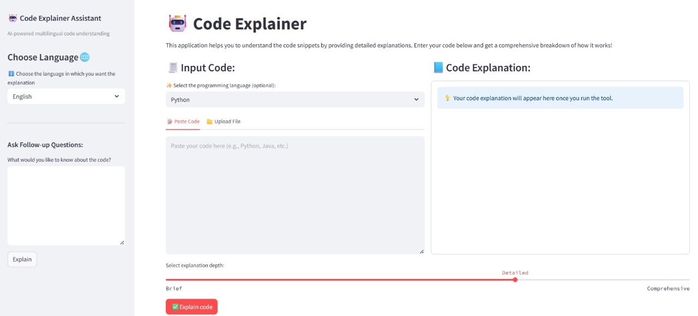
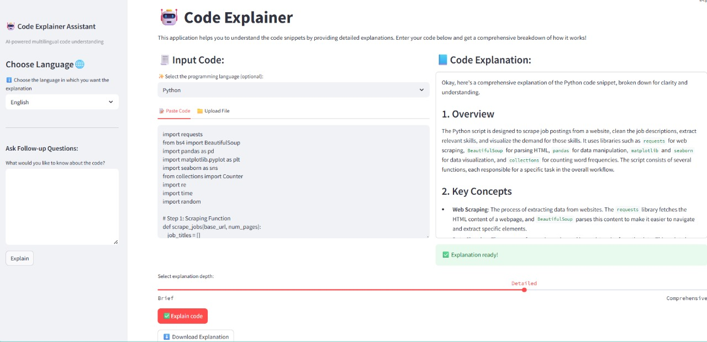

# 🤖 Code Explainer: AI-Powered Multilingual Code Understanding Assistant

> ✨ Turn raw code into structured, human-friendly explanations using LangChain LCEL + Gemini 2.0 Flash.

---

## Overview

**Code Explainer** is an advanced AI-driven assistant that translates complex code into plain-language breakdowns, step-by-step logic, and teaching-friendly summaries. Powered by Google Gemini 2.0 Flash and LangChain’s LCEL (LangChain Expression Language), this tool is designed for accuracy, multilingual delivery, and developer ease.

---

### Who is it for?

- **Developers** decoding unfamiliar or legacy codebases
-  **Students** mastering programming concepts
-  **Educators** simplifying code for teaching
-  **Recruiters/Interviewers** reviewing code submissions
-  **Anyone** learning or explaining programming

---

## Key Features

- **Chunking Logic**     — Handles code up to 80 lines per segment for stable LLM responses
-  **LLM-Powered Summarization** — Gemini 2.0 Flash for high-quality explanations
-  **Multilingual Output** — Choose from English, Hindi, Telugu, Tamil, Malayalam, Bengali, Marathi, and more
-  **Markdown-Formatted Results** — Ready to copy, review, or download
-  **Flexible Input** — Paste code or upload files (.py, .cpp, .js, etc.)
-  **Explanation Levels** — Ranging from Brief to Comprehensive (line-by-line)
-  **Follow-up Question Support** — Ask questions directly about the code after explanation
- **Download Support** — Export explanations in `.md` format

---

## Screenshots

### User Interface


### Sample Output


---

## How It Works

> **Pipeline Overview**

1. Code is uploaded or pasted by the user.
2.  Code is chunked to avoid token overflows.
3.  Prompts are structured using LangChain’s `PromptTemplate`.
4.  Gemini 2.0 Flash processes and explains each chunk.
5.  Output is cleaned, filtered for duplicates, and displayed in real-time.
6.  User can ask follow-up queries; LLM replies intelligently.
7.  Explanation can be downloaded instantly.

**Architecture**: Built on a modular LangChain pipeline with prompt control, Gemini model abstraction, and semantic filtering for duplicate prevention.

---

## Tech Stack

| Component        | Technology             |
|------------------|------------------------|
|  LLM Model     | Google Gemini **2.0 Flash** |
| Backend Logic | LangChain LCEL         |
|  Frontend       | Streamlit              |
|  Env Handling  | python-dotenv          |
|  Deployment    | Streamlit Cloud / Local |

---

## Installation Guide

```bash
# 1. Clone the repo
git clone https://github.com/yourusername/code-explainer
cd code-explainer

# 2. Install dependencies
pip install -r requirements.txt

# Add your Gemini API key to a .env file:
GOOGLE_API_KEY=your_api_key_here

#### Run the Streamlit app:
streamlit run ui.py

## File Structure
📁 code-explainer/
├── ui.py                # Streamlit UI with tabs, dropdowns, multilingual support
├── code_explainer.py    # LangChain + Gemini logic: chunking, explanation, QA
├── requirements.txt     # Python dependencies
├── .env                 # Environment variables (API keys)
├── ui1.jpg              # UI Screenshot
├── ui2.jpg              # Output Screenshot
```

## Real-World Impact
 
#### Recruitment Automation
Reduced manual review time by 60% across 50+ candidate submissions.

#### University Integration:

Helped students interpret unfamiliar code (C++, Python) with up to 80% comprehension improvement.

#### Multilingual Reach:

Empowered non-English users with code explanations in local Indian languages.
